<!-- README.md is generated from README.Rmd. Please edit that file -->

# bre <a href="https://zwcrowley.github.io/bre/"></a>

<!-- badges: start -->

[](https://lifecycle.r-lib.org/articles/stages.html#experimental)
<!-- badges: end -->

The goal of `bre` is to make data cleaning and the creation of
visualizations easier and faster for Blackstone Research and Evaluation.
`bre` contains functions to create visuals with Blackstone Research and
Evaluation branding and helper functions for common data cleaning and
manipulation tasks for everyone at Blackstone Research and Evaluation.

## Installation

You can install the development version of `bre` from
[GitHub](https://github.com/) with:

``` r
# install.packages("devtools")
devtools::install_github("zwcrowley/bre")
```

On the initial installation you will also have to install and import
fonts from `extrafont` package:

``` r
# install.packages("extrafont")
library(extrafont)
# Import fonts to get "Arial", this only has to be done one time, then `bre` package will use the code below to load the fonts automatically 
# for the functions that require that step:
extrafont::font_import()
# Load all fonts:
extrafont::loadfonts("all", quiet = TRUE)
```

## Usage

``` r
library(bre)
```

To begin, it is best to convert our numeric data that we use at
Blackstone Research and Evaluation to factor variables:

### `recodeCat()`

`recodeCat()` is a helper function to recode numeric data into factor
variables with the desired levels.

`recodeCat()` takes in two arguments:

**df** Required, a
[tibble](https://tibble.tidyverse.org/reference/tibble-package.html)/data
frame of survey items that are numeric variables that need to be
converted into factor variables. Numeric variables in the data can be
anywhere from 3 to 7 point scales.

**scale_labels** Required, a named character vector of labels of the
desired scale levels for the new factor variables. The function will use
this vector to convert the numeric variables into factor variables, all
levels must be supplied in the correct range otherwise else NA will be
returned for variables outside the range of user supplied values. The
named character vector should have the new labels as the “name” and the
old labels as the “variable” like this: c(“<new label>” =
“<original variable value>”) which would look like this:
`levels_min_ext <- c("Minimal" = "1", "Slight" = "2", "Moderate" = "3", "Good" = "4", "Extensive" = "5")`

``` r
items <- dplyr::tibble(
  pre_Organization = c(1, 2, 3, 4, 5, 4, 3, 2, 1),
  post_Organization = dplyr::if_else(pre_Organization < 5, pre_Organization + 1, pre_Organization),
  pre_Source = c(2, 2, 3, 5, 4, 3, 2, 1, 2),
  post_Source = dplyr::if_else(pre_Source < 4, pre_Source + 2, pre_Source),
  pre_Publish = c(1, 1, 1, 2, 2, 2, 3, 3, 3),
  post_Publish = pre_Publish + 2,
  pre_Write = c(2, 2, 2, 3, 3, 3, 4, 4, 4),
  post_Write = pre_Write + 1,
  pre_Research = c(1, 1, 2, 2, 3, 3, 4, 4, 4),
  post_Research = pre_Research + 1
)
# Set up the named vector to pass to scale_labels, follow this pattern- c("<new label>" = "<original variable value>"):
levels_min_ext <- c("Minimal" = "1", "Slight" = "2", "Moderate" = "3", "Good" = "4", "Extensive" = "5")
cat_items_1 <- bre::recodeCat(df = items, scale_labels = levels_min_ext)
cat_items_1
#> # A tibble: 9 × 20
#>   pre_Organization post_Organization pre_Source post_Source pre_Publish
#>              <dbl>             <dbl>      <dbl>       <dbl>       <dbl>
#> 1                1                 2          2           4           1
#> 2                2                 3          2           4           1
#> 3                3                 4          3           5           1
#> 4                4                 5          5           5           2
#> 5                5                 5          4           4           2
#> 6                4                 5          3           5           2
#> 7                3                 4          2           4           3
#> 8                2                 3          1           3           3
#> 9                1                 2          2           4           3
#> # ℹ 15 more variables: post_Publish <dbl>, pre_Write <dbl>, post_Write <dbl>,
#> #   pre_Research <dbl>, post_Research <dbl>, cat_pre_Organization <fct>,
#> #   cat_post_Organization <fct>, cat_pre_Source <fct>, cat_post_Source <fct>,
#> #   cat_pre_Publish <fct>, cat_post_Publish <fct>, cat_pre_Write <fct>,
#> #   cat_post_Write <fct>, cat_pre_Research <fct>, cat_post_Research <fct>
```

The user simply passes a data frame of all the items to be recoded with
a named character vector of the 5 scale likert levels in the
corresponding order as the numeric data.

## Data Visualizations Examples

`bre` currently contains three helper functions for generating
visualizations: `stackedBarChart()`, `divBarChart()`, `arrowChart()`,
and `arrowChartGroup()`.

### `stackedBarChart()`

`stackedBarChart()` creates a fully stacked bar chart that has the
branding/style of Blackstone Research and Evaluation.

`stackedBarChart()` takes up to 8 arguments, first 2 are *required*:

**df** Required, A
[tibble](https://tibble.tidyverse.org/reference/tibble-package.html) or
data frame of survey items that are categorical/factor variables, in 5
point scales, can be a single time point or pre-post, that will be
inserted into a stacked bar chart with Blackstone Research and
Evaluation branding.

**scale_labels** scale_labels Required, a character vector of labels for
the response scale, must be in the desired order, e.g. if you have a 5
item scale of minimal to extensive it should look like this:
`levels_min_ext <- c("Minimal", "Slight", "Moderate", "Good", "Extensive")`.
This argument accepts a character vector of 3 to 7 items.

**pre_post** Logical, default is FALSE. If true, returns a pre-post
stacked bar chart, arranged by question, this requires data structured
as pre-post. If FALSE, returns a stacked bar chart of a single time
point.

**overall_n** Logical, default is FALSE. If TRUE, returns an overall *n*
for all questions that is in the upper left tag of the plot. If False,
adds *n* to each question/item after the respective labels.

**percent_label** Logical, default is TRUE. Labels the bars based on
percentages. If FALSE, labels the bars with the number of answers per
response.

**question_labels** Default is NULL. Takes in a named character vector
to both supply labels the questions and sort the order of the questions.
The named character vector should have the new labels as the “name” and
the old labels as the “variable” sorted in the desired order of
appearing in the plot, first item will appear at the top of the plot.
See examples.

**question_order** Logical, default is FALSE. If TRUE, the question
order will be taken from the user supplied named character vector passed
to question_labels, where the first item will be at the top of the plot
and so on. If FALSE, the question order will be the questions with
highest positive valenced response options on the top of the plot
descending.

**width** Input a value between 0.3 and 0.8 to set the thickness of the
bars. Default is NULL.

#### **Examples using** `stackedBarChart()`

#### Single Time Point Data with Percentage labels Example for `stackedBarChart()`:

``` r
# Single time point data:
items_single <- dplyr::tibble(
  Organization = c(1, 2, 3, 4, 5, 4, 3, 2, 1),
  Source = c(2, 2, 3, 5, 4, 3, 2, 1, 2),
  Publish = c(1, 1, 1, 2, 2, 2, 3, 3, 3),
  Write = c(2, 2, 2, 3, 3, 3, 4, 4, 4),
  Research = c(1, 1, 2, 2, 3, 3, 4, 4, 4)
)
# scale_labels as a named character vector, items in correct order:
levels_min_ext <- c("Minimal" = "1", "Slight" = "2", "Moderate" = "3", "Good" = "4", "Extensive" = "5")

# bar_scale_labels as just the names from levels_min_ext:
bar_scale_labels <- names(levels_min_ext)

# Question labels as a named vector with the naming structure like this: c("{new label}" = "{original variable name}"):
question_labels <- c("Publish a lot of high quality papers" =  "Publish",
                     "Write a lot of research papers" = "Write",
                     "Research in a lab with faculty" = "Research",
                     "Organization of a large research project" = "Organization",
                     "Source work for a research paper" = "Source")
# Recode the numeric to factor variables using the levels from levels_min_ext:
cat_items_single <- bre::recodeCat(items_single, levels_min_ext)
# Select the factor variables:
cat_items_single <- cat_items_single %>% dplyr::select(dplyr::where(is.factor))
# Pass the factor variables and the levels to 'stackedBarChart()':
stacked_chart_single <- bre::stackedBarChart(
   df = cat_items_single, pre_post = FALSE, scale_labels = bar_scale_labels,
   percent_label = TRUE, width = 0.6
)
stacked_chart_single
```

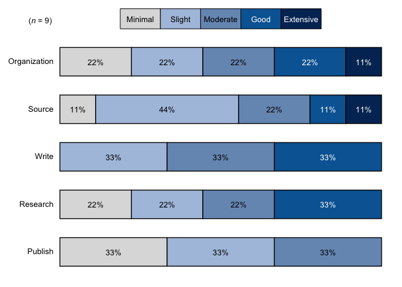

``` r
# With new labels and order taken from `question_labels` argument, each 
# item has it's own sample size in the label:
stacked_chart_single_labels <- bre::stackedBarChart(
   df = cat_items_single, pre_post = FALSE, scale_labels = bar_scale_labels, overall_n = FALSE,
   question_labels = question_labels, question_order = TRUE, percent_label = TRUE, width = 0.6
)
stacked_chart_single_labels
```

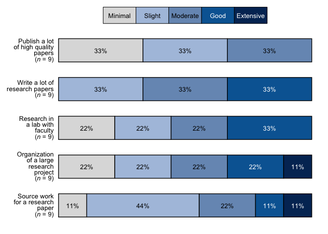

#### Pre-Post Data Example for `stackedBarChart()`

``` r
# Select only the categorical/factor vars from the df in the from the oriinal recodeCat() in the first chunk (cat_items_1) using select(tidyselect::where(is.factor):
cat_items <- cat_items_1 %>% dplyr::select(tidyselect::where(is.factor))

# Run the function with the factor items and the character vector of the factor levels:
stacked_chart_pre_post <- bre::stackedBarChart(
   df = cat_items, pre_post = TRUE, scale_labels = bar_scale_labels,
   percent_label = TRUE, width = NULL
)
stacked_chart_pre_post
```

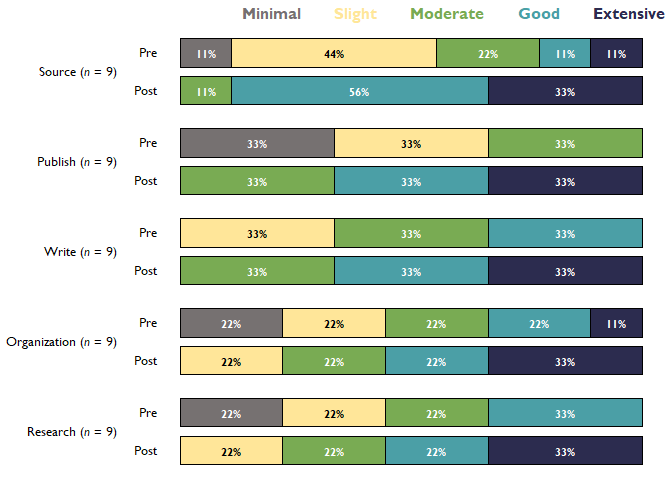

``` r
# With new labels and order taken from question_labels argument, each 
# item has it's own sample size in the label:
stacked_chart_pre_post_labels <- bre::stackedBarChart(
   df = cat_items, pre_post = TRUE, scale_labels = bar_scale_labels, overall_n = FALSE,
   question_labels = question_labels, question_order = TRUE, percent_label = TRUE, width = NULL
)
stacked_chart_pre_post_labels
```


### `divBarChart()`

`divBarChart()` creates a diverging and fully stacked bar chart that has
the branding and style of Blackstone Research and Evaluation.

`divBarChart()` takes in up to 7 arguments, the first 2 are *required*:

**df** Required, A
[tibble](https://tibble.tidyverse.org/reference/tibble-package.html)/data
frame of survey items that are categorical/character variables, in 3 to
7 point scales, that will be inserted into a diverging bar chart with
Blackstone Research and Evaluation branding.

**scale_labels**scale_labels Required, a character vector of labels for
the response scale, must be in the desired order, e.g. if you have a 5
item scale of minimal to extensive it should look like this:
`levels_min_ext <- c("Minimal", "Slight", "Moderate", "Good", "Extensive")`.
This argument accepts a character vector of 3 to 7 items.

**overall_n** Logical, default is FALSE. If TRUE, returns an overall *n*
for all questions that is in the upper left tag of the plot. If False,
adds *n* to each question/item after the respective labels.

**percent_label** Logical, default is TRUE. If FALSE, labels the bars
with the number of answers per response.

**question_labels** Default is NULL. Takes in a named character vector
to both supply labels the questions and sort the order of the questions.
The named character vector should have the new labels as the “name” and
the old labels as the “variable” sorted in the desired order of
appearing in the plot, first item will appear at the top of the plot.
See examples.

**question_order** Logical, default is FALSE. If TRUE, the question
order will be taken from the user supplied named character vector passed
to question_labels, where the first item will be at the top of the plot
and so on. If FALSE, the question order will be the questions with
highest positive valenced response options on the top of the plot
descending.

**width** Input a value between 0.3 and 0.8 to set the thickness of the
bars. Default is NULL.

#### **Examples using** `divBarChart()`

#### Single Time Point Data with Percentage labels Example for `divBarChart()`:

``` r
# Pass the single time point factor variables and the levels to 'divBarChart()':
div_chart_single <- bre::divBarChart(
   df = cat_items_single, pre_post = FALSE, scale_labels = bar_scale_labels,
   percent_label = TRUE, width = 0.6
)
div_chart_single
```

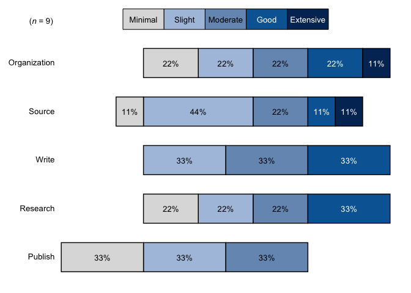

``` r
# With new labels and order taken from `question_labels` argument, each 
# item has it's own sample size in the label:
div_chart_single_labels <- bre::divBarChart(
   df = cat_items_single, pre_post = FALSE, scale_labels = bar_scale_labels, overall_n = FALSE,
   question_labels = question_labels, question_order = TRUE, percent_label = TRUE, width = 0.6
)
div_chart_single_labels
```

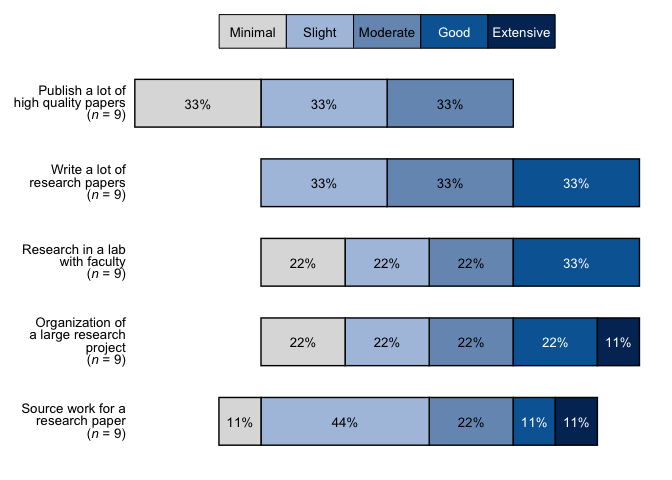

#### Pre-Post Data Example for `divBarChart()`

``` r
# Pass the factor variables and the levels to 'divBarChart()', set so that it 
# returns the percent labels on the bars:
div_chart <- divBarChart(
  df = cat_items, pre_post = TRUE, scale_labels = bar_scale_labels,
  question_labels = NULL, percent_label = TRUE, width = NULL, fill_colors = "seq"
)
div_chart
```

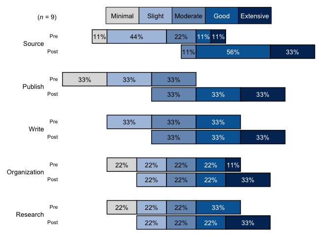

``` r
# With new labels and order taken from question_labels argument:
div_chart_labels <- divBarChart(
  df = cat_items, pre_post = TRUE, scale_labels = bar_scale_labels,
  question_labels = question_labels, question_order = TRUE,
  percent_label = TRUE, width = NULL, fill_colors = "seq"
)
div_chart_labels
```

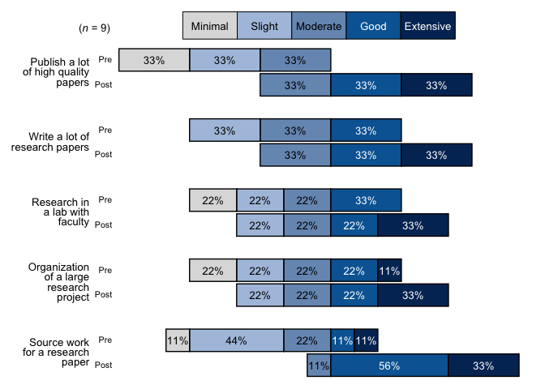

### `arrowChart()`

`arrowChart()` takes in 6 arguments, the first 3 are *required*:

**df** Required, a
[tibble](https://tibble.tidyverse.org/reference/tibble-package.html) or
data frame of **numeric** data that has items with the prefix of `pre_`
and `post_`.

**scale_labels** Required, a character vector of labels for the response
scale, must be in the desired order, e.g. a 5 item scale of minimal to
extensive it should look like this:
`levels_min_ext <- c("Minimal", "Slight", "Moderate", "Good", "Extensive")`.

**arrow_colors** Required, a character vector of hex codes for colors to
associate each item, needs to be the same length or longer than the
items to place in the same chart.

**overall_n** Logical, default is FALSE. If TRUE, returns an overall *n*
for all questions that is in the upper left tag of the plot. If False,
adds *n* to each question/item after the respective labels.

**question_labels** Default is NULL. Takes in a named character vector
to both supply labels the questions and sort the order of the questions.
The named character vector should have the new labels as the “name” and
the old labels as the “variable” sorted in the desired order of
appearing in the plot, first item will appear at the top of the plot.
See examples.

**question_order** Logical, default is FALSE. If TRUE, the question
order will be taken from the user supplied named character vector passed
to question_labels, where the first item will be at the top of the plot
and so on. If FALSE, the question order will be the questions with
highest post score average on the top of the plot descending.

`arrowChart()` creates an arrow chart from numeric data based on the
pre-post averages for each item with the branding and style of
Blackstone Research and Evaluation. `arrowChart()` sorts the chart with
the highest post scores on the top and lowest on the bottom.

#### **Examples using** `arrowChart()`

``` r
# Select only the numeric variables from the df in the last chunk (cat_items_1) using tidy select(contains("cat")), adding a group variable that is set as a factor:
items <- dplyr::tibble(
  pre_Organization = c(1, 2, 3, 4, 5, 4, 3, 2, 1),
  post_Organization = dplyr::if_else(pre_Organization < 5, pre_Organization + 1, pre_Organization),
  pre_Source = c(2, 2, 3, 5, 4, 3, 2, 1, 2),
  post_Source = dplyr::if_else(pre_Source < 4, pre_Source + 2, pre_Source),
  pre_Publish = c(1, 1, 1, 2, 2, 2, 3, 3, 3),
  post_Publish = pre_Publish + 2,
  pre_Write = c(2, 2, 2, 3, 3, 3, 4, 4, 4),
  post_Write = pre_Write + 1,
  pre_Research = c(1, 1, 2, 2, 3, 3, 4, 4, 4),
  post_Research = pre_Research + 1
)

# Set up the labels for the x-axis, this will match the numeric response in the data:
levels_min_ext <- c("Minimal", "Slight", "Moderate", "Good", "Extensive")

# Question labels as a named vector with the naming structure like this: c("{new label}" = "{original variable name}"):
question_labels <- c("Publish a lot of high quality papers" =  "Publish",
                    "Write a lot of research papers" = "Write",
                    "Research in a lab with faculty" = "Research",
                    "Organization of a large research project" = "Organization",
                    "Source work for a research paper" = "Source")


# Example with n for each question and original labels:
arrow_chart_1 <- bre::arrowChart(df = items, scale_labels = levels_min_ext, 
                                 overall_n = FALSE, question_labels = NULL, question_order = FALSE)
arrow_chart_1
```

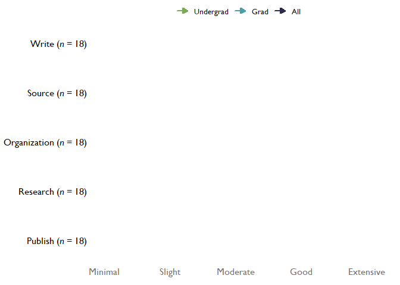

``` r

# With new labels, question_order = FALSE, and overall_n set to TRUE:
arrow_chart_labels <- bre::arrowChart(df = items, scale_labels = levels_min_ext, 
                                      overall_n = FALSE, question_labels = question_labels, question_order = FALSE)
arrow_chart_labels
```

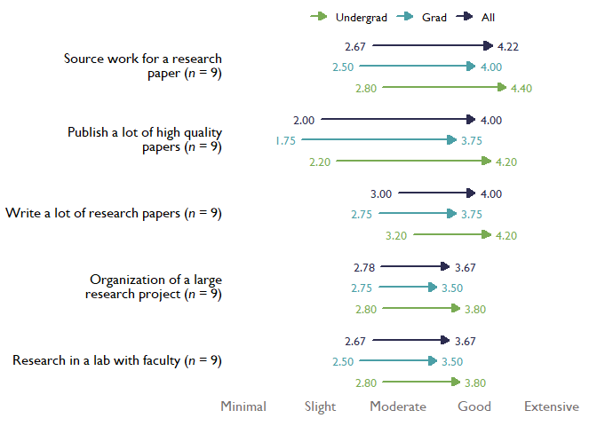

``` r

# With new labels and order taken from question_labels argument, and overall_n set to FALSE:
arrow_chart_labels_ordered <- bre::arrowChart(df = items, scale_labels = levels_min_ext, 
                                              overall_n = FALSE, question_labels = question_labels, question_order = TRUE)
arrow_chart_labels_ordered
```

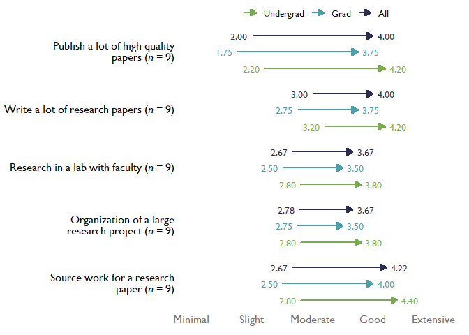

### `arrowChartGroup()`

`arrowChartGroup()` takes in 6 arguments, the first 3 are *required*:

**df** Required, a
[tibble](https://tibble.tidyverse.org/reference/tibble-package.html) or
data frame of **numeric** data that has items with the prefix of `pre_`
and `post_`; and has a categorical group variable to split up the data
(e.g. role, gender, education level, etc.).

**group** Required, the name of the grouping variable in a quoted
character string (e.g. “role”, “gender”, “edu_level”, etc.).

**scale_labels** scale_labels Required, a character vector of labels for
the response scale, must be in the desired order, e.g. if you have a 5
item scale of minimal to extensive it should look like this:
`levels_min_ext <- c("Minimal", "Slight", "Moderate", "Good", "Extensive")`.

**group_colors** Required, a character vector of hex codes for colors to
associate each group to, e.g. this data has two groups and this function
creates an overall group so this function will need a ‘group_colors’
character vector of three colors. ‘group_colors’ need to be in the order
you want them associated to the group based on the factor levels for the
group variable, last color will be the overall group of “all”

**overall_n** Logical, default is FALSE. If TRUE, returns an overall *n*
for all questions that is in the upper left tag of the plot. If False,
adds *n* to each question/item after the respective labels.

**question_labels** Default is NULL. Takes in a named character vector
to both supply labels the questions and sort the order of the questions.
The named character vector should have the new labels as the “name” and
the old labels as the “variable” sorted in the desired order of
appearing in the plot, first item will appear at the top of the plot.
See examples.

**question_order** Logical, default is FALSE. If TRUE, the question
order will be taken from the user supplied named character vector passed
to question_labels, where the first item will be at the top of the plot
and so on. If FALSE, the question order will be the questions with
highest post score average on the top of the plot descending.

`arrowChartGroup()` creates an arrow chart from numeric data based on
the pre-post averages for each group and the overall group for the whole
data set with the branding and style of Blackstone Research and
Evaluation. `arrowChartGroup()` sorts the chart with the highest post
scores on the top and lowest on the bottom.

#### **Examples using** `arrowChartGroup()`

``` r
# Add a group variable `edu_level` that is set as a factor to the numeric items above called `items`:
arrow_items <- items %>%
  dplyr::mutate(
    edu_level = factor(c(
      "grad", "undergrad", "grad", "undergrad", "grad", "undergrad", "undergrad", "grad", "undergrad"
    ), levels = c("grad", "undergrad"))
  )

# Set up the labels for the x-axis, this will match the numeric response in the data:
levels_min_ext <- c("Minimal", "Slight", "Moderate", "Good", "Extensive")

# Question labels as a named vector with the naming structure like this: c("{new label}" = "{original variable name}"):
question_labels <- c("Publish a lot of high quality papers" =  "Publish",
                    "Write a lot of research papers" = "Write",
                    "Research in a lab with faculty" = "Research",
                    "Organization of a large research project" = "Organization",
                    "Source work for a research paper" = "Source")

# Example with n for each question and original labels:
arrow_chart_grouped <- bre::arrowChartGroup(df = arrow_items, group = "edu_level", group_levels = c("grad", "undergrad"),
                                            scale_labels = levels_min_ext, overall_n = FALSE, question_labels = NULL, 
                                            question_order = FALSE)
arrow_chart_grouped
```

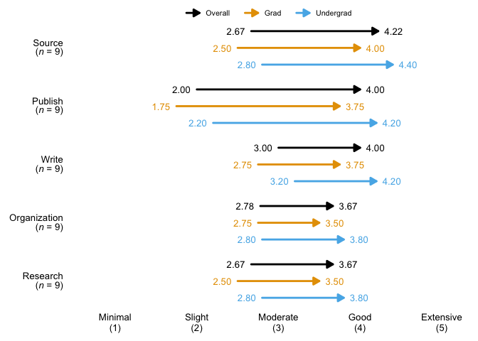

``` r

# With new labels, question_order = FALSE, and overall_n set to TRUE:
arrow_chart_grouped_labels <- bre::arrowChartGroup(df = arrow_items, group = "edu_level", group_levels = c("grad", "undergrad"),
                                                   scale_labels = levels_min_ext, overall_n = FALSE, question_labels = question_labels, 
                                                   question_order = FALSE)
arrow_chart_grouped_labels
```

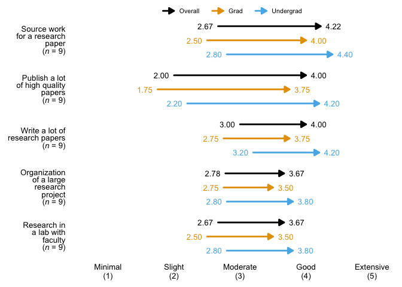

``` r

# With new labels and order taken from question_labels argument, and overall_n set to FALSE:
arrow_chart_grouped_labels_ordered <- bre::arrowChartGroup(df = arrow_items, group = "edu_level", group_levels = c("grad", "undergrad"), 
                                                           scale_labels = levels_min_ext, overall_n = FALSE, question_labels = question_labels, 
                                                           question_order = TRUE)
arrow_chart_grouped_labels_ordered
```

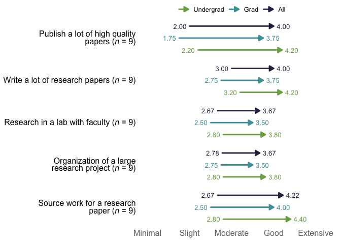

More functions and visuals will be added to `bre` package as needed, be
sure to reach out with any ideas for the package or issues!
