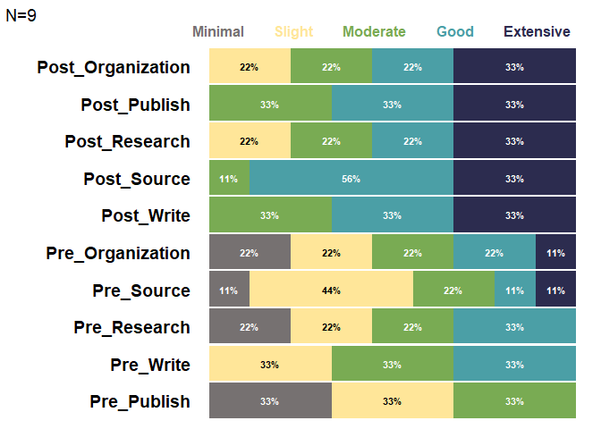

<!-- README.md is generated from README.Rmd. Please edit that file -->

# TheMarkUSA

<!-- badges: start -->
<!-- badges: end -->

The goal of TheMarkUSA is to make data cleaning and visualizations
easier and faster for The Mark USA, Inc. The functions in TheMarkUSA
create visuals with The Mark USA, Inc. branding and helper functions for
common data cleaning and manipulation tasks for use for everyone at The
Mark, USA Inc.

## Installation

You can install the development version of TheMarkUSA from
[GitHub](https://github.com/) with:

``` r
# install.packages("devtools")
devtools::install_github("zcrowleyTheMark/TheMarkUSA")
```

## Example

A common problem with the current workflow at The Mark is converting
numeric data to character/factor variables, especially 5 item likert
scales: recodeFiveCat is a helper function to recode numeric data with 5
levels into categorical/factor variables.

``` r
library(TheMarkUSA)
items <- dplyr::tibble(Pre_Organization = c(1,2,3,4,5,4,3,2,1), 
                       Post_Organization = dplyr::if_else(Pre_Organization < 5, Pre_Organization + 1, Pre_Organization),
                       Pre_Source = c(2,2,3,5,4,3,2,1,2), 
                       Post_Source = dplyr::if_else(Pre_Source < 4, Pre_Source + 2, Pre_Source),
                       Pre_Publish = c(1,1,1,2,2,2,3,3,3), 
                       Post_Publish = Pre_Publish + 2,
                       Pre_Write = c(2,2,2,3,3,3,4,4,4), 
                       Post_Write = Pre_Write + 1,
                       Pre_Research = c(1,1,2,2,3,3,4,4,4), 
                       Post_Research = Pre_Research + 1)

levels_min_ext <- c("Minimal", "Slight", "Moderate", "Good", "Extensive")
cat_items_1 <- recodeFiveCat(items, levels_min_ext)
cat_items_1
#> # A tibble: 9 × 20
#>   Pre_Organization Post_Organization Pre_Source Post_Source Pre_Publish
#>              <dbl>             <dbl>      <dbl>       <dbl>       <dbl>
#> 1                1                 2          2           4           1
#> 2                2                 3          2           4           1
#> 3                3                 4          3           5           1
#> 4                4                 5          5           5           2
#> 5                5                 5          4           4           2
#> 6                4                 5          3           5           2
#> 7                3                 4          2           4           3
#> 8                2                 3          1           3           3
#> 9                1                 2          2           4           3
#> # ℹ 15 more variables: Post_Publish <dbl>, Pre_Write <dbl>, Post_Write <dbl>,
#> #   Pre_Research <dbl>, Post_Research <dbl>, cat_Pre_Organization <fct>,
#> #   cat_Post_Organization <fct>, cat_Pre_Source <fct>, cat_Post_Source <fct>,
#> #   cat_Pre_Publish <fct>, cat_Post_Publish <fct>, cat_Pre_Write <fct>,
#> #   cat_Post_Write <fct>, cat_Pre_Research <fct>, cat_Post_Research <fct>
```

The user simply passes a data frame of all the items to be recoded with
a character vector of the 5 scale likert labels.

## Data Visualizitons Examples

TheMarkUSA currently contains two helper functions for generating
visualizations: stackedBarChart and divBarChart.

Both take in two arguments: **df** A tibble/data frame of survey items
that are categorical/character variables, in 5 point scales and
pre-post, that will be inserted into a stacked bar chart with The Mark
USA branding. **set_5\_levels** character vector of 5 levels to set the
scale for the plot

stackedBarChart creates a fully stacked bar chart that has the
branding/style of The Mark USA, INC.

``` r
# Select only the categorical/factor vars from the df in the last chunk (cat_items_1) using tidy select(contains("cat")):
cat_items_plot <- cat_items_1 %>% dplyr::select(contains("cat"))
# Run the function with the categorical items and the character vector of the factor levels:
stacked_chart_1 <- stackedBarChart(cat_items_plot,levels_min_ext)

stacked_chart_1
```



divBarChart creates a diverging and fully stacked bar chart that has the
branding/style of The Mark USA, INC.

``` r
# Select only the categorical/factor vars from the df in the last chunk (cat_items_1) using tidy select(contains("cat")):
cat_items_plot <- cat_items_1 %>% dplyr::select(contains("cat"))
# Run the function with the categorical items and the character vector of the factor levels:
div_chart_1 <- divBarChart(cat_items_plot,levels_min_ext)

div_chart_1
```


More functions and visuals will be added to TheMarkUSA as needed, be
sure to reach out with any ideas for the package or issues!
