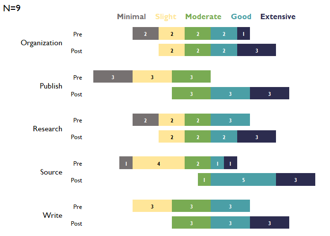

<!-- README.md is generated from README.Rmd. Please edit that file -->

# TheMarkUSA <a href="https://zcrowleythemark.github.io/TheMarkUSA/"></a>

<!-- badges: start -->

[](https://lifecycle.r-lib.org/articles/stages.html#experimental)
<!-- badges: end -->

The goal of `TheMarkUSA` is to make data cleaning and the creation of
visualizations easier and faster for The Mark USA, Inc. The functions in
`TheMarkUSA` create visuals with The Mark USA branding and helper
functions for common data cleaning and manipulation tasks for use for
everyone at The Mark USA, Inc.

## Installation

You can install the development version of `TheMarkUSA` from
[GitHub](https://github.com/) with:

``` r
# install.packages("devtools")
devtools::install_github("zcrowleyTheMark/TheMarkUSA")
```

## Usage

``` r
library(TheMarkUSA)
```

To begin, it is best to convert our numeric data that we use at The Mark
USA, Inc. to factor variables:

### `recodeCat()`

`recodeCat()` is a helper function to recode numeric data into factor
variables with the desired levels.

`recodeCat()` takes in three arguments:

**df** Required, a \[tibble\]\[tibble::tibble-package\]/data frame of
survey items that are numeric variables that need to be converted into
factor variables. Numeric variables in the data can be anywhere from 3
to 7 point scales.

**scale_labels** Required, a character vector of labels of the desired
scale levels. The function will use this vector to convert the numeric
variables into factor variables, must be arranged low to high with the
exact number of levels as the data contains, or else NA will be
returned.

**number_levels** A character vector that of all the numeric values
original numeric variables that are to be recoded, in the correct order.
Both scale_labels and number_levels should be in the same order that the
user wants the variables to be recoded. For example, if a variable from
df has 3 numeric values of 1,2,and 3, to be recoded to as “Minimal”,
“Slight”, “Moderate”, number_levels should equal: c(1,2,3) and
scale_labels should equal: c(“Minimal”, “Slight”, “Moderate”). See more
examples below. Defaults to NULL.

``` r
items <- dplyr::tibble(
  Pre_Organization = c(1, 2, 3, 4, 5, 4, 3, 2, 1),
  Post_Organization = dplyr::if_else(Pre_Organization < 5, Pre_Organization + 1, Pre_Organization),
  Pre_Source = c(2, 2, 3, 5, 4, 3, 2, 1, 2),
  Post_Source = dplyr::if_else(Pre_Source < 4, Pre_Source + 2, Pre_Source),
  Pre_Publish = c(1, 1, 1, 2, 2, 2, 3, 3, 3),
  Post_Publish = Pre_Publish + 2,
  Pre_Write = c(2, 2, 2, 3, 3, 3, 4, 4, 4),
  Post_Write = Pre_Write + 1,
  Pre_Research = c(1, 1, 2, 2, 3, 3, 4, 4, 4),
  Post_Research = Pre_Research + 1
)
# scale_labels for 5 item example
levels_min_ext <- c("Minimal", "Slight", "Moderate", "Good", "Extensive")
cat_items_1 <- TheMarkUSA::recodeCat(df = items, scale_labels = levels_min_ext, number_levels = c(1,2,3,4,5))
cat_items_1
#> # A tibble: 9 × 20
#>   Pre_Organization Post_Organization Pre_Source Post_Source Pre_Publish
#>              <dbl>             <dbl>      <dbl>       <dbl>       <dbl>
#> 1                1                 2          2           4           1
#> 2                2                 3          2           4           1
#> 3                3                 4          3           5           1
#> 4                4                 5          5           5           2
#> 5                5                 5          4           4           2
#> 6                4                 5          3           5           2
#> 7                3                 4          2           4           3
#> 8                2                 3          1           3           3
#> 9                1                 2          2           4           3
#> # ℹ 15 more variables: Post_Publish <dbl>, Pre_Write <dbl>, Post_Write <dbl>,
#> #   Pre_Research <dbl>, Post_Research <dbl>, cat_Pre_Organization <fct>,
#> #   cat_Post_Organization <fct>, cat_Pre_Source <fct>, cat_Post_Source <fct>,
#> #   cat_Pre_Publish <fct>, cat_Post_Publish <fct>, cat_Pre_Write <fct>,
#> #   cat_Post_Write <fct>, cat_Pre_Research <fct>, cat_Post_Research <fct>
```

The user simply passes a data frame of all the items to be recoded with
a character vector of the 5 scale likert levels in the corresponding
order as the numeric data.

## Data Visualizations Examples

`TheMarkUSA` currently contains three helper functions for generating
visualizations: `stackedBarChart()`, `divBarChart()`, and
`arrowChart()`.

### `stackedBarChart()`

`stackedBarChart()` creates a fully stacked bar chart that has the
branding/style of The Mark USA, Inc.

`stackedBarChart()` takes up to 7 arguments, first 2 are required:

**df** Required, A \[tibble\]\[tibble::tibble-package\] or data frame of
survey items that are categorical/factor variables, in 5 point scales,
can be a single time point or pre-post, that will be inserted into a
stacked bar chart with The Mark USA branding.

**scale_labels** Required, a character vector of levels to set the scale
for the plot, accepts a character vector of 3 to 7 items.

**pre_post** Logical, default is FALSE. If true, returns a pre-post
stacked bar chart, arranged by question, this requires data structured
as pre-post. If FALSE, returns a stacked bar chart of a single time
point.

**overall_n** Logical, default is FALSE. If TRUE, returns an overall n
for all questions that is in the upper left tag of the plot.

**percent_label** Logical, default is TRUE. Labels the bars based on
percentages. If FALSE, labels the bars with the number of answers per
response.

**question_labels** Default is NULL. Takes in a named character vector
to both supply labels the questions and sort the order of the questions.
The named character vector should have the new labels as the “name” and
the old labels as the “variable” sorted in the desired order of
appearing in the plot, first item will appear at the top of the plot.
See examples.

**question_order**Logical, default is FALSE. If TRUE, the question order
will be taken from the user supplied named character vector passed to
question_labels, where the first item will be at the top of the plot and
so on. If FALSE, the question order will be the questions with highest
positive valenced response options on the top of the plot descending.

**width** Input a value between 0.3 and 0.8 to set the thickness of the
bars. Default is NULL.

#### **Examples using** `stackedBarChart()`

#### Single Time Point Data with Percentage labels Example for `stackedBarChart()`:

``` r
# Single time point data:
items_single <- dplyr::tibble(
  Organization = c(1, 2, 3, 4, 5, 4, 3, 2, 1),
  Source = c(2, 2, 3, 5, 4, 3, 2, 1, 2),
  Publish = c(1, 1, 1, 2, 2, 2, 3, 3, 3),
  Write = c(2, 2, 2, 3, 3, 3, 4, 4, 4),
  Research = c(1, 1, 2, 2, 3, 3, 4, 4, 4)
)
# scale_labels as a character vector, items in correct order:
levels_min_ext <- c("Minimal", "Slight", "Moderate", "Good", "Extensive")
# Question labels as a named vector with the naming structure like this: c("{new label}" = "{original variable name}"):
question_labels <- c("Publish a lot of high quality papers" =  "Publish",
                     "Write a lot of research papers" = "Write",
                     "Research in a lab with faculty" = "Research",
                     "Organization of a large research project" = "Organization",
                     "Source work for a research paper" = "Source")
# Recode the numeric to factor variables using the levels from levels_min_ext:
cat_items_single <- TheMarkUSA::recodeCat(items_single, levels_min_ext)
# Select the factor variables:
cat_items_single <- cat_items_single %>% dplyr::select(dplyr::where(is.factor))
# Pass the factor variables and the levels to 'stackedBarChart()':
stacked_chart_single <- TheMarkUSA::stackedBarChart(
   df = cat_items_single, pre_post = FALSE, scale_labels = levels_min_ext,
   percent_label = TRUE, width = 0.6
)
stacked_chart_single
```


``` r
# With new labels and order taken from question_labels argument:
stacked_chart_single_labels <- TheMarkUSA::stackedBarChart(
   df = cat_items_single, pre_post = FALSE, scale_labels = levels_min_ext,
   question_labels = question_labels, question_order = TRUE, percent_label = TRUE, width = 0.6
)
stacked_chart_single_labels
```


#### Pre-Post Data Example for `stackedBarChart()`

``` r
# Select only the categorical/factor vars from the df in the from the oriinal recodeCat() in the first chunk (cat_items_1) using select(tidyselect::where(is.factor):
cat_items_plot <- cat_items_1 %>% dplyr::select(tidyselect::where(is.factor))

# Run the function with the factor items and the character vector of the factor levels:
stacked_chart_pre_post <- TheMarkUSA::stackedBarChart(
   df = cat_items_plot, pre_post = TRUE, scale_labels = levels_min_ext,
   percent_label = TRUE, width = NULL
)
stacked_chart_pre_post
```


``` r
# With new labels and order taken from question_labels argument:
stacked_chart_pre_post_labels <- TheMarkUSA::stackedBarChart(
   df = cat_items_plot, pre_post = TRUE, scale_labels = levels_min_ext,
   question_labels = question_labels, question_order = TRUE, percent_label = TRUE, width = NULL
)
stacked_chart_pre_post_labels
```


### `divBarChart()`

`divBarChart()` creates a diverging and fully stacked bar chart that has
the branding and style of The Mark USA, Inc.

`divBarChart()` takes in up to six arguments, first two are required:

**df** Required, A \[tibble\]\[tibble::tibble-package\] or data frame of
survey items that are categorical/factor variables, in 5 point scales,
must be pre-post data, that will be inserted into a stacked bar chart
with The Mark USA branding.

**scale_labels** Required, character vector of levels of the factor
variables to be added to the plot, this will set the scale for the
x-axis of the bar chart and its labels.

**percent_label** Default is TRUE. Labels the bars based on percentages.
If FALSE, labels the bars with the number of answers per response.

**question_order** A character vector to sort the order of the
questions. Default is NULL.

**question_labels** A character vector that will label the questions.
Needs to be in same order as question_order. Default is NULL.

**width** Input a value between 0.3 and 0.8 to set the thickness of the
bars. Default is NULL.

``` r
# Select only the categorical/factor vars from the df in the last chunk (cat_items_1) using tidy select(contains("cat")):
cat_items_plot <- cat_items_1 %>% dplyr::select(tidyselect::where(is.factor))
# Run the function with the categorical items and the character vector of the factor levels:
div_chart_1 <- TheMarkUSA::divBarChart(
  df = cat_items_plot, scale_labels = levels_min_ext,
  percent_label = TRUE, width = 0.7
)

div_chart_1
```



### `arrowChart()`

`arrowChart()` take in three arguments:

**df** A \[tibble\]\[tibble::tibble-package\]/data frame of survey items
that are numeric variables, must be in 5 point scales and pre-post, that
will be inserted into a stacked bar chart with The Mark USA branding.

**scale_labels** character vector to set up the labels for the x-axis,
this will match the numeric response in the data.

**group_colors** character vector of hex codes for colors to associate
to each group to, e.g. this data has two groups and this function
creates an overall group so the user needs to pass the function in the
group_colors argument a character vector of three colors- colors need to
be in the order you want them associated to the group based on the
factor levels for the group variable, last color will be the overall
group of “all”.

`arrowChart()` creates an arrow chart from numeric data based on the
pre-post averages for each group and the overall group for the whole
data set with the branding and style of The Mark USA,
Inc. `arrowChart()` sorts the chart with the highest post scores on the
top and lowest on the bottom.

``` r
# Select only the numeric variables from the df in the last chunk (cat_items_1) using tidy select(contains("cat")), adding a group variable that is set as a factor:
arrow_items <- cat_items_1 %>%
  dplyr::select(tidyselect::where(is.numeric)) %>%
  dplyr::mutate(
    group = c(
      "grad", "undergrad", "grad", "undergrad", "grad", "undergrad", "undergrad", "grad", "undergrad"
    ),
    group = factor(group, levels = c("grad", "undergrad"))
  )
# Set up the labels for the x-axis, this will match the numeric response in the data:
levels_min_ext <- c("Minimal", "Slight", "Moderate", "Good", "Extensive")

threeScale_theMark_colors <- c("#79AB53", "#4B9FA6", "#2C2C4F")

# Run the function with the first argument being the data frame of numeric items and factor group variable, second argument is the levels for the x-axis labels, and the third argument is the colors to pass as the  and the character vector of the factor levels:
arrow_chart_1 <- TheMarkUSA::arrowChart(df = arrow_items, scale_labels = levels_min_ext, group_colors = threeScale_theMark_colors)

arrow_chart_1
```


More functions and visuals will be added to `TheMarkUSA` as needed, be
sure to reach out with any ideas for the package or issues!
