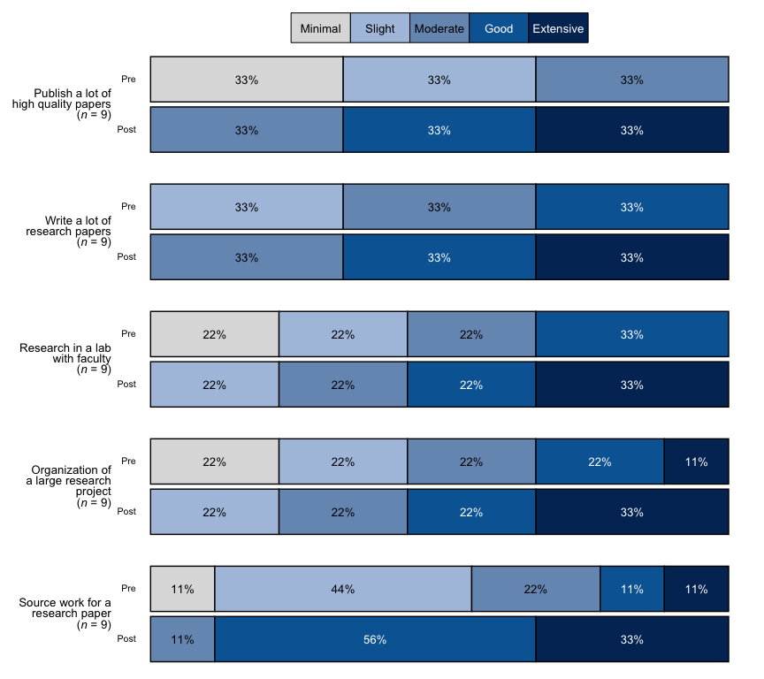

<!-- README.md is generated from README.Rmd. Please edit that file -->

# bre <a href="https://zwcrowley.github.io/bre/"></a>

<!-- badges: start -->

[](https://lifecycle.r-lib.org/articles/stages.html#experimental)
<!-- badges: end -->

The goal of `bre` is to make data cleaning and the creation of
visualizations easier and faster for Blackstone Research and Evaluation.
`bre` contains functions to create visuals with Blackstone Research and
Evaluation branding and helper functions for common data cleaning and
manipulation tasks for everyone at Blackstone Research and Evaluation.

## Installation

You can install the development version of `bre` from
[GitHub](https://github.com/) with:

``` r
# install.packages("devtools")
devtools::install_github("zwcrowley/bre")
```

On the initial installation you will also have to install and import
fonts from `extrafont` package:

``` r
# install.packages("extrafont")
library(extrafont)
# Import fonts to get "Arial", this only has to be done one time, then `bre` package will use the code below to load the fonts automatically 
# for the functions that require that step:
extrafont::font_import()
# Load all fonts:
extrafont::loadfonts("all", quiet = TRUE)
```

## Usage

``` r
library(bre)
# Example pre-post data:
items <- dplyr::tibble(
  pre_Organization = c(1, 2, 3, 4, 5, 4, 3, 2, 1),
  post_Organization = dplyr::if_else(pre_Organization < 5, pre_Organization + 1, pre_Organization),
  pre_Source = c(2, 2, 3, 5, 4, 3, 2, 1, 2),
  post_Source = dplyr::if_else(pre_Source < 4, pre_Source + 2, pre_Source),
  pre_Publish = c(1, 1, 1, 2, 2, 2, 3, 3, 3),
  post_Publish = pre_Publish + 2,
  pre_Write = c(2, 2, 2, 3, 3, 3, 4, 4, 4),
  post_Write = pre_Write + 1,
  pre_Research = c(1, 1, 2, 2, 3, 3, 4, 4, 4),
  post_Research = pre_Research + 1
)
# Set up the named vector to pass to scale_labels, follow this pattern- c("<new label>" = "<original variable value>"):
levels_min_ext <- c("Minimal" = "1", "Slight" = "2", "Moderate" = "3", "Good" = "4", "Extensive" = "5")
# Recode numeric variables to factors using `recodeCat()` and select the factor variables:
cat_items <- bre::recodeCat(df = items, scale_labels = levels_min_ext) %>% 
                dplyr::select(dplyr::where(is.factor))

# bar_scale_labels as just the names from levels_min_ext:
bar_scale_labels <- names(levels_min_ext)

# Question labels as a named vector with the naming structure like this: c("{new label}" = "{original variable name}"):
question_labels <- c("Publish a lot of high quality papers" =  "Publish",
                     "Write a lot of research papers" = "Write",
                     "Research in a lab with faculty" = "Research",
                     "Organization of a large research project" = "Organization",
                     "Source work for a research paper" = "Source")

# With new labels and order taken from `question_labels` argument, each 
# item has it's own sample size in the label:
bre::stackedBarChart(
   df = cat_items, pre_post = TRUE, scale_labels = bar_scale_labels, overall_n = FALSE,
   question_labels = question_labels, question_order = TRUE, percent_label = TRUE
)
```



See vignettes for more examples of all the functions this package and
how they work.

## Getting help

More functions and visuals will be added to `bre` package as needed, be
sure to reach out with any ideas for the package or issues!

If you encounter a clear bug or need any help with this package, please
reach out to me on the Google Chat space, direct message me or email.
