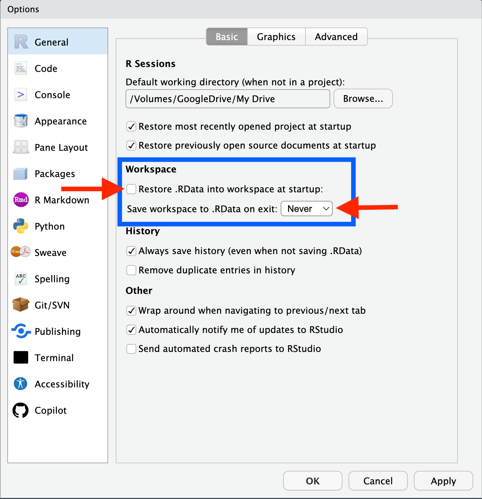
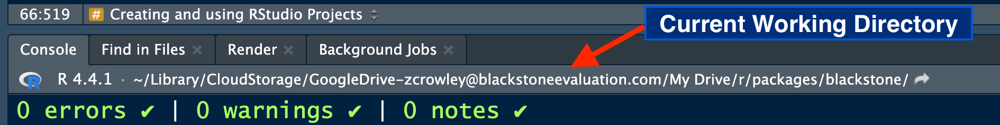
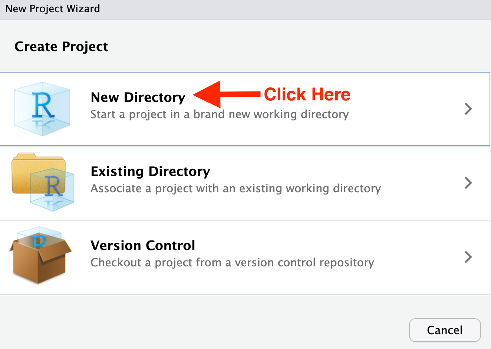
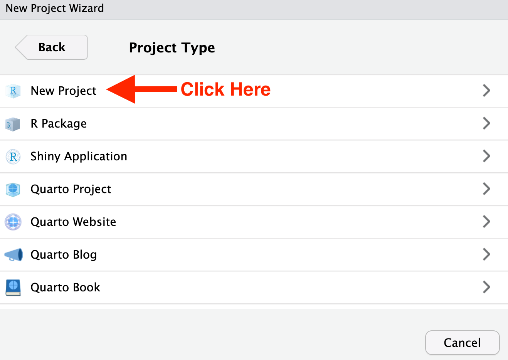
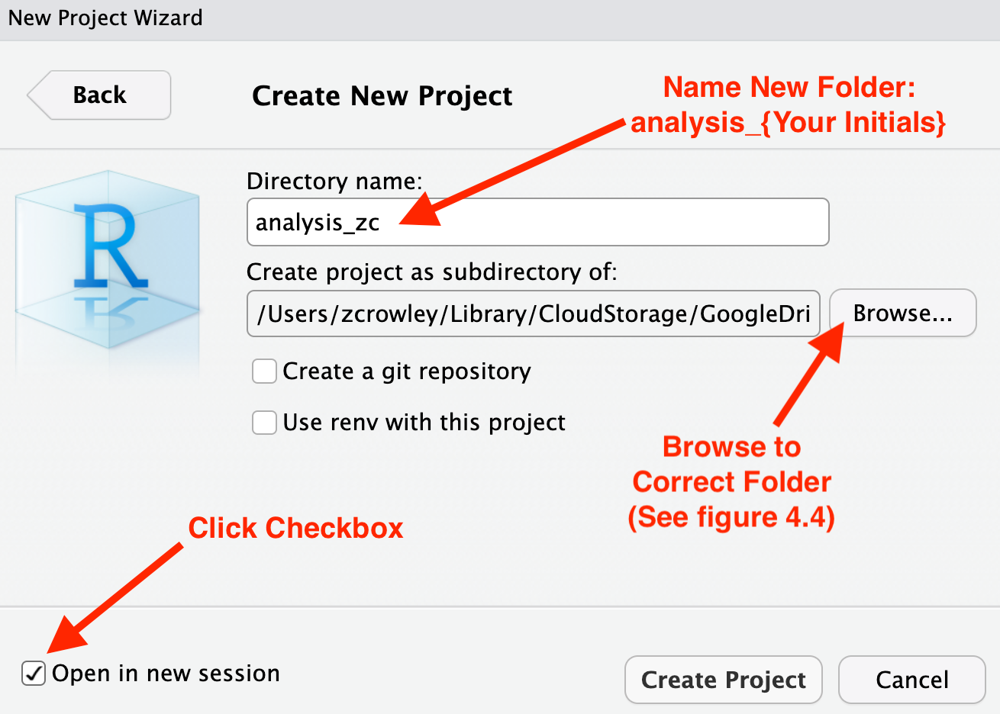
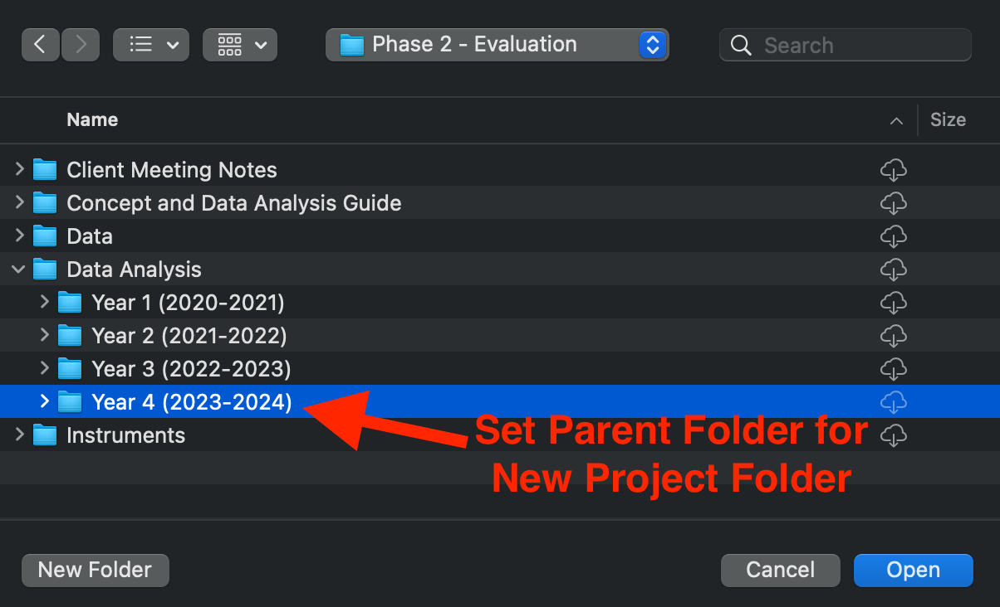
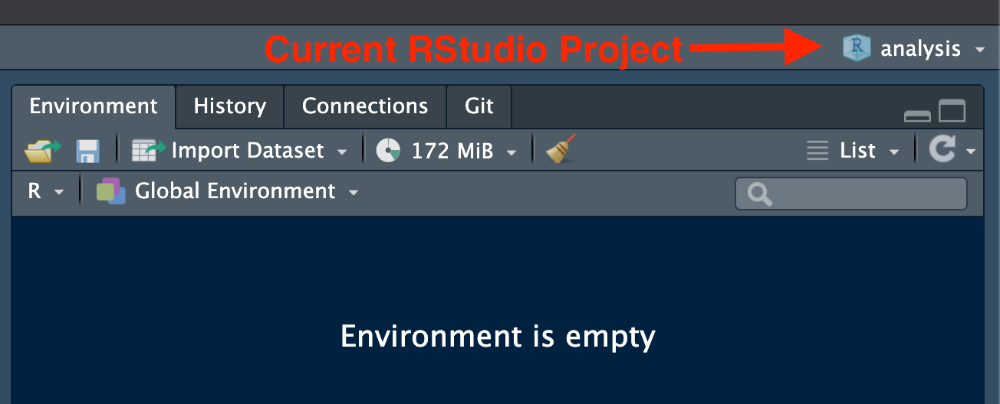

```{r setup,  echo = FALSE, message = FALSE, include = FALSE}
knitr::opts_chunk$set(
  collapse = TRUE,
  comment = "#>",
  fig.width = 9,
  fig.height = 8,
  out.width = "100%"
)
options(scipen = 999, digits = 4, # Prevents sci notation and sets the output of decimals to 4 (0.0000)
        tibble.print_min = 5L, tibble.print_max = 5L) # tibble only print 5 rows 
# library(blackstone) # load Blackstone R package
set.seed(424629) # set reproducible seed
# Set up filepath to "demo project" folder:
demo_proj_fp <- fs::path_package("2429_DEMO", package = "blackstone")

```

This vignette will go over best practices and standard workflows for using `R` and `RStudio` for Blackstone Research and Evaluation (**`BRE`**).

This will include:

- A brief introduction to `R` and `RStudio`

- A discussion of shared workflow and file management at **`BRE`**.

- Setting up basic global options in `RStudio`.

- Creating and using **`RStudio` Projects**.

- Using the `here` package to build relative file paths using `.Rproj` files.

## Introduction and Installation of `R` and `RStudio`

[`RStudio`](https://posit.co/products/open-source/rstudio/) is an integrated development environment (IDE) that is designed to run [`R`](https://www.r-project.org/), an open-source programming language for statistical computing and graphics. Both `R` and `RStudio` should be kept up to date, the most current release for each can be found at the respective links here: ["Install `R`"](https://cran.rstudio.com/) and ["Install `RStudio`"](https://posit.co/download/rstudio-desktop/).

## Shared Workflow

At Blackstone Research and Evaluation, we will strive to utilize best practices with data science and that starts with implementing a shared workflow in order to make all of our work reproducible across all of our projects. 

A shared workflow will ensure that anyone at **`BRE`** will be able to open any work product (Rmarkdown files '.Rmd' or `R` scripts '.R') and run it on their own local machine to reproduce the exact same results as the original author. This 'code as truth' approach reduces confusion and saves time since `R` is doing the work once the code is produced and it will be unnecessary to spend a lot of time pointing and clicking to save files or create figures in other applications.

In order to achieve this, we must use the same standard workflow, file management, and setup in `RStudio`.

## File Management

All work products (Rmarkdown files '.Rmd' or `R` scripts '.R') created in the course of completing a data analysis task, including any data cleaning and transformation, should be saved to the correct Blackstone Google Drive project folder.[^drive]

[^drive]: The Blackstone Google Drive project folder is called "The Mark Client Projects".

Our project folders in the Blackstone Google Drive have a standard folder structure, which looks something like this:[^demo]

[^demo]: The `blackstone` package contains a folder structure to emulate a standard Blackstone project folder, I had to change the naming conventions slightly to include it so the folder names are a bit different. All spaces are switched to '_' and I removed 'and' in some folder titles.

```{r folders_demo, echo = FALSE}
# Only directories:
fs::dir_tree(demo_proj_fp, type = "directory", recurse = 2)
```

All raw survey data files should be kept in the correct project year folder in the `Phase 2 - Evaluation/Data` folder. So if you have survey data from 'Year 4 (2023-2024)' of a project it should be save in `Phase 2 - Evaluation/Data/Year 4 (2023-2024)`. Using subfolders at the project year level will help to organize data from pre and post surveys, or multiple surveys with different topics for a given year.

All data analysis files should be kept in the correct project year folder in the `Phase 2 - Evaluation/Data Analysis` folder. 

Later, we will go over how to use **`RStudio` Projects** to create a subfolder in the correct project year folder in `Phase 2 - Evaluation/Data Analysis` folder to organize these files and how to run all analyses in the Google Drive folder by importing data from the `Phase 2 - Evaluation/Data` subfolders. First, lets turn to some basic setup for `RStudio`.

## `RStudio` Setup

Our workflow for data analysis at **`BRE`** should center around producing `R` code that is reproducible for anyone. We need to all maintain `RStudio` settings which help to facilitate that process.

The first step is to make sure that each new `R` session is a blank slate and nothing that we have done previously carries over to our current work.

There are two ways to do this: 

1. Either run `usethis::use_blank_slate()`[^usethis] or

[^usethis]: If the `usethis` package is not installed, install it with: `install.packages("usethis")`

2. In `RStudio`, go to the top menu bar and select '**Tools**', then '**Global Options**', '**General**' settings and make sure the '**Workspace**' section (in the blue box) matches the options in figure 1 below: 

```{r global_options, fig.cap = "Figure 1: RStudio Global Options", echo = FALSE}
# knitr::include_graphics(
#     "/Users/zcrowley/Library/CloudStorage/GoogleDrive-zcrowley@blackstoneevaluation.com/My Drive/r/packages/blackstone/vignettes/r_global_options.png"
#     )

```

This will ensure that each new `R` session starts with any empty global environment (no data or variables from a previous session). 

Also, it is important to routinely restart your `R` session and re-run your code to make sure that everything in code produces the expected results, figures, and outputs.
This can be done by in `RStudio` by first saving your current work in the Rmarkdown file(s) (.Rmd) or `R` script(s) (.R) file, and then by selecting '**Session**' in to the top menu bar, clicking on '**Restart R**'.[^restart_r] This will clear your global environment and unload all R packages.

[^restart_r]: '**Restart R**' keyboard shortcuts are for **Windows**: `Ctrl+Shift+F10` or for **Mac**: `Shift+Command+0`

Re-run your code to ensure it includes everything necessary to complete the assigned data tasks.

## Creating and using RStudio Projects

### Introduction to RStudio Projects

In order to have a shared workflow, we have to have a standard way to set up and organize all of files necessary for project work at **`BRE`**. We also need a way to set the working directory[^wd] for each `R` session that is reproducible across different users. Using `setwd()` in code will work for the original author, but subsequent users will have to change this file path. 

[^wd]: The terms "folder" and "directory" are used interchangeably here. The term "working directory" is specific to how `R` works with folders on your local machine. `R` uses the working directory as the starting point to building relative paths to other folders on your machine.

`RStudio` supports this with **`RStudio` Projects**. An [**`RStudio` Project**](https://support.posit.co/hc/en-us/articles/200526207-Using-RStudio-Projects) allows the user to launch `RStudio` with its associated folder designated as the current working directory. Designating a new or existing folder as an **`RStudio` Project** creates a new file in that folder with the extension `.Rproj`, this file saves the settings for the Project, among other things. In the next section, we will go over how to use this file to set up relative file paths using the designated Project folder as the root directory.

Double-clicking on the `.Rproj`, will launch a fresh `RStudio` instance with a new `R` process that has the working directory set to the parent folder. This allows the user to easily switch between projects and not have to worry about setting the working directory or starting a new `R` process/clean global environment. Multiple instances of `RStudio` can also be opened to different **Projects** at the same time. 

The file browser in each the `RStudio` instance will show the current working directory, see figure 2:
```{r file_browser_wd, fig.cap = "Figure 2: RStudio File Browser", echo = FALSE}
knitr::include_graphics("file_browser.png")
```

It is also shown just above the **`R` Console** as shown in figure 3:

```{r console_wd, fig.cap = "Figure 3: RStudio Console Working Directory", echo = FALSE}

```


### Creating an RStudio Project

To create a new **RStudio Project**, go to the top menu bar and select '**File**', then click on '**New Project...**', which will launch the '**New Project Wizard**'.

On the first page '**Create Project**', Select '**New Directory**': 

```{r new_proj_01, fig.cap = "Figure 4.1: New Project Wizard- Create Project", echo = FALSE}

```

On the second page '**Project Type**', Select '**New Project**': 

```{r new_proj_02, fig.cap = "Figure 4.2: New Project Wizard- Project Type", echo = FALSE}

```

On the third page '**Create New Project**', check the box for '**Open in new session**' in lower-left corner, set the '**Directory name**' to 'analysis_{Your Initials}',
In '**Create project as subdirectory of**'. click '**Browse...**', then navigate to the correct project folder: shown below in the next figure 4.4.


```{r new_proj_03, fig.cap = "Figure 4.3: New Project Wizard- Name and Set Parent Folder", echo = FALSE}

```

If hypothetically, you were tasked with a data analysis for Year 4 (2023-2024) of a project, you would go set the parent folder (where the new project folder will be created) to `Phase 2 - Evaluation/Data Analysis/Year 4 (2023-2024)`. 

After you click on '**Browse...**' next to '**Create project as subdirectory of**': navigate to the project folder in the Google Drive then go to the evaluation folder- '**Phase 2 - Evaluation**', then the '**Data Analysis**' then '**Year 4 (2023-2024)**' and click '**Open**'

```{r new_proj_04, fig.cap = "Figure 4.4: Browse to Correct Project Folder", echo = FALSE}

```

Finally, after setting the correct parent folder, you will be back on the third page '**Create New Project**'. 

If you have completed the above steps, the settings should resemble figure 4.5 below and you can proceed to click '**Create Project**' in the lower-right corner. This will launch the new Project named 'analysis_{Your Initials}'

```{r new_proj_05, fig.cap = "Figure 4.5: New Project Wizard- Create New Project", echo = FALSE}
knitr::include_graphics("new_proj_05_create.png")
```

Now that we have an **RStudio Project** we can use it to save all of the files necessary for a data analysis task inside its folder and we don't have to worry about using `setwd()` to manage the working directory. 

## Managing File Paths with the `here` Package

In order to highlight another advantage for working in an **RStudio Project**, let's say we were tasked with the data analysis of a hypothetical Blackstone project. The project folder named `2429_DEMO` in the Blackstone Google Drive and the analysis is for its fourth year (`Year 4 (2023-2024)`). 

We have completed the above steps to create an **RStudio Project** in the `Phase 2 - Evaluation/Data Analysis/Year 4 (2023-2024)` folder which we named 'analysis' as shown in the directory tree below, there is a subfolder of `Phase 2 - Evaluation/Data Analysis/Year 4 (2023-2024)` named 'analysis' with an **RStudio Project** file named `analysis.Rproj`. We have also created an Rmarkdown file in the same folder called `report.Rmd`.

```{r demo_analysis_dir, echo = FALSE}
# Only folders and files without an .txt extension :
fs::dir_tree(fs::path(demo_proj_fp, "Phase2_Evaluation", "Data_Analysis"), glob = "*.txt", invert = TRUE)
```


To launch the **`RStudio` Project** we can either go to the top menu bar in `RStudio`, click '**File**', '**Open Project...**' and navigate to the `analysis.Rproj` and click '**Open**' or go to your operating system's File Finder/Explorer navigate to the `analysis.Rproj` and double-click it.

To confirm which **`RStudio` Project** is open in your current `RStudio` instance go to the top-right corner of `RStudio`.

```{r current_proj}
#| echo: FALSE
#| fig.cap: >
#|  Figure 5: Current RStudio Project (top-right corner of IDE)
#| fig.alt: >
#|   Image of RStudio top-right corner of IDE with arrow pointing out 
#|   the display of the RStudio project that is currently open. 

```

If you click on the current **`RStudio` Project** shown above, a drop-down menu gives you options to switch between **Projects** or open new `RStudio` instances to run multiple projects at once.

Now, if we have opened the **`RStudio` Project** file `analysis.Rproj` our working directory will be set to the analysis `folder` with this file path: ``r fs::path(demo_proj_fp, "Phase2_Evaluation", "Data_Analysis", "analysis")``

But that is the file path on *my* local machine, it would differ based on the location of the `2429_DEMO` folder because how your Google Drive Desktop is set up (different user names or shortcut IDs). This also creates an issue if we want to navigate to the `Data` folder in our code to import data for analysis. How do we write out a file path that is stable over time and for different users?

### Introduction to the `here` Package

The [`here`](https://here.r-lib.org) package solves this issue by using **`RStudio` Project** files (`.Rproj`) to create relative file paths. In `R` anytime we set the working directory (either by using `setwd()` or by opening an **`RStudio` Project**), we can reference file paths using paths relative to the working directory. But if that file path changes, either by moving folders or by the code running on different machines

The `here` packages provides a way to always reference the location of a specified **`RStudio` Project** files (`.Rproj`) as the *root* directory for relative file paths, even if the working directory is switched to a subfolder of an **`RStudio` Project** folder (which is the case when knitting an .Rmd file).

The `here` package has two simple functions which allow us build reproducible file paths.

### Using the `here` Package

If the `here` package is not installed, install it with: `install.packages("here")`

The first step is to set the current location of the file you are working in using `here::i_am()`[^attaching_here] with a relative path to the project root directory. This has to be done at the beginning of an `R` script ('.R') or first code chunk in an Rmarkdown file ('.Rmd').

[^attaching_here]: Since the `here` package is not yet called by 

If we were working in the file `report.Rmd` contained inside the `analysis` folder that would look like this:

```{r, include = FALSE}
analysis_fp <- fs::path(demo_proj_fp, "Phase2_Evaluation", "Data_Analysis", "Year4_(2023-2024)", "analysis") # set up analysis file path
knitr::opts_knit$set(root.dir = analysis_fp) # set up analysis file path as knitr root directory 
```

```{r}
here::i_am("report.Rmd")
```

`here::i_am()` returns the project root directory. Since the file `report.Rmd` is contained alongside the `analysis.Rproj` file inside the `analysis` folder, the call above returns the file path to the `analysis` folder.

Once we have called `here::i_am()`, we can then load the `here` package and use the `here()` to again return the project root folder. 

```{r}
library(here)
here()
```

To be clear, the `here()` function differs from just returning the current working directory. In fact, if you change the working directory and `here()` will still return the project root directory set by the initial call to `here::i_am()`. 

### Relative File Paths with `here()`

Now, we can use `here()` to build relative paths to read and write data. This works by including the folder and file destination inside the function, either as a single string or separated by commas. If we wanted to build a path to the `Data` folder in our example project folder, let's see how that would work. 

First, it is helpful to review the folder structure:

```{r eval_dir_2, echo = FALSE}
# Only folders and files without an .txt extension :
fs::dir_tree(fs::path(demo_proj_fp, "Phase2_Evaluation"), glob = "*.txt", invert = TRUE)
```

In order to build a path from the `Phase2_EvaluationData_Analysis/Year4_(2023-2024)/analysis` (which is out top-level project directory) to the `Phase2_Evaluation/Data` folder, we need to go "up" three levels which is done with file paths using ".." like this: `../../../`, using `here()` this looks like:

```{r data_fp}
# Setting up file path to the Data folder for Year 4:
data_fp <- here("../../../Data") # or can be written as: here("..", ".." ,".." ,"Data")
data_fp
```

This path can be added to other file paths to complete the desired path to any number of files within the `Data` folder.

Returning to the original example evaluation folder, if we want to read in data from the `Data/Year 4 (2023-2024)` folder to run analyses in the `report.Rmd` we can set up a series of file paths using `here()`.

```{r year_four_fp}
# Setting up file path to the Data folder for Year 4:
data_year4_fp <- here(data_fp, "Year4_(2023-2024)") # or can be written as: here("..", ".." ,".." ,"Data", "Year4_(2023-2024)")
data_year4_fp
```

We can re-use that file path to build the rest of the path needed to read in the clean data from Year 4:

```{r read_clean_data}
# File path to clean data from Year 4 named: "sm_data_clean.csv"
here(data_year4_fp, "clean_data", "sm_data_clean.csv") 
# or can be written as: here("..", ".." ,".." ,"Data", "Year4_(2023-2024)", "clean_data", "sm_data_clean.csv")

# Reading in the clean data from Year 4 named: "sm_data_clean.csv"
readr::read_csv(file = here(data_year4_fp, "clean_data", "sm_data_clean.csv"), show_col_types = FALSE, n_max = 3, col_select = c(1,6:12))
```


## Additional Resources for `R`, `RStudio`, and Project Workflows

- *R for data science*: ["Workflow: 6.2 Projects"](https://r4ds.hadley.nz/workflow-scripts.html#projects) chapter by Hadley Wickham

- *What They Forgot to Teach You About R*: ["3  Project-oriented workflow"](https://rstats.wtf/projects.html) chapter by Jenny Bryan, Jim Hester, Shannon Pileggi, and E. David Aja

- ["Project-oriented workflow"](https://www.tidyverse.org/blog/2017/12/workflow-vs-script/) Tidyverse Blog Post by Jenny Bryan


