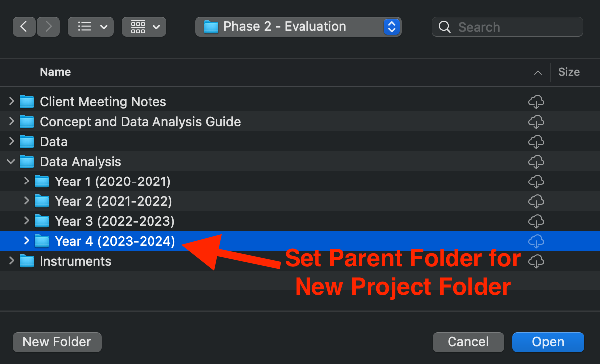

```{r setup,  echo = FALSE, message = FALSE, include = FALSE}
knitr::opts_chunk$set(
  collapse = TRUE,
  comment = "#>",
  warning = FALSE, 
  message = FALSE, 
  fig.width = 9,
  fig.height = 8,
  out.width = "100%"
)
options(scipen = 999, digits = 4, # Prevents sci notation and sets the output of decimals to 4 (0.0000)
        tibble.print_min = 5L, tibble.print_max = 5L) # tibble only print 5 rows 
# library(blackstone) # load Blackstone R package
set.seed(424629) # set reproducible seed
# Set up filepath to "demo project" folder:
demo_proj_fp <- fs::path_package("2429_DEMO-PROJ", package = "blackstone")

# resource_files:
#   - img/r_global_options.png
#   - img/file_browser.png
#   - img/console_wd.png
#   - img/new_proj_01.png
#   - img/new_proj_02_type.png
#   - img/new_proj_03_dir.png
#   - img/new_proj_04_browse.png
```

This vignette will go over best practices and standard workflows for using `R` and `RStudio` for Blackstone Research and Evaluation (**`BRE`**). 

This will include:

- Setting up basic global options in `RStudio`.

- Creating and using RStudio Projects.

- Using the `here` package to build file paths using `.Rproj` files.

## Shared Workflow

[`RStudio`](https://posit.co/download/rstudio-desktop/) is an integrated development environment (IDE) that is designed to run [`R`](https://www.r-project.org/), a  programming language. At Blackstone Research and Evaluation, we will strive to utilize best practices with data science and that starts with implementing a shared workflow. in order to make all of our work reproducible across all projects.

Any work product (Rmarkdown or `R` script) should be saved to the correct Blackstone Google Drive project folder. Anyone at **`BRE`** should be able to open the Rmarkdown (Rmd) or `R` script and run it on their own local machine to reproduce the results. In order to achieve this, we must use the same standard workflow and setup in `RStudio`.

## `RStudio` Setup

The first step is to make sure that each new `R` session is a blank slate and nothing that we have done previously carries over to our current work.

There are two ways to do this: 

1. Either run `usethis::use_blank_slate()`^[If the `usethis` package is not installed, install it with: `install.packages("usethis")`] or 

2. In `RStudio`, go to the top menu bar and select '**Tools**', then '**Global Options**', '**General**' settings and make sure the '**Workspace**' section (in the blue box) matches the options in figure 1 below: 

```{r global_options, fig.cap = "Figure 1: RStudio Global Options", echo = FALSE}
knitr::include_graphics("img/r_global_options.png")
```

This will ensure that each new `R` session is a blank slate. 

Also, it is important to routinely restart your `R` session and re-run your code to make sure that everything in code produces the expected results, figures, and outputs.
This can be done by in `RStudio` by selecting '**Session**' in to the top menu bar clicking on '**Restart R**' (Windows keyboard shortcut: Ctrl+Shift+F10, Mac: Shift+Command+0). This will clear your global environment and unload all R packages.

Re-run your code to ensure it includes everything necessary to complete the assigned data tasks.

## Creating and using RStudio Projects

### Introduction to RStudio Projects

In order to have a shared workflow, we have to have a standard way to set up and organize all of files necessary for project work at **`BRE`**. 

`RStudio` supports this with **RStudio Projects**. An [**`RStudio` Project**](https://support.posit.co/hc/en-us/articles/200526207-Using-RStudio-Projects) allows the user to launch `RStudio` with its associated folder designated as the current working directory. Designating a new or existing folder as an **`RStudio` Project** creates a new file in that folder with the extension `.Rproj`, this file saves the settings for the Project, among other things. In the next section, we will go over how to use this file to set up relative file paths using the designated Project folder as the root directory.

Double-clicking on the `.Rproj`, will launch a fresh `RStudio` instance with a new `R` process that has the working directory set to the parent folder. This allows the user to easily switch between projects and not have to worry about setting the working directory or starting a new `R` process/clean global environment. Multiple instances of `RStudio` can also be opened to different **Projects** at the same time. 

The file browser in each the `RStudio` instance will show the current working directory, see figure 2:
```{r file_browser_wd, fig.cap = "Figure 2: RStudio File Browser", echo = FALSE}
knitr::include_graphics("img/file_browser.png")
```

It is also shown just above the **`R` Console** as shown in figure 3:

```{r console_wd, fig.cap = "Figure 3: RStudio Console Working Directory", echo = FALSE}
knitr::include_graphics("img/console_wd.png")
```


### Creating an RStudio Project

To create a new **RStudio Project**, go to the top menu bar and select '**File**', then click on '**New Project...**', which will launch the '**New Project Wizard**'.

On the first page '**Create Project**', Select '**New Directory**': 

```{r new_proj_01, fig.cap = "Figure 4.1: New Project Wizard- Create Project", echo = FALSE}
knitr::include_graphics("img/new_proj_01.png")
```

On the second page '**Project Type**', Select '**New Project**': 

```{r new_proj_02, fig.cap = "Figure 4.2: New Project Wizard- Project Type", echo = FALSE}
knitr::include_graphics("img/new_proj_02_type.png")
```

On the third page '**Create New Project**', check the box for '**Open in new session**' in lower-left corner, set the '**Directory name**' to `analysis_{Your Initials}`,
In '**Create project as subdirectory of**'. click '**Browse...**', then navigate to the correct project folder(as shown below in the next figure 4.4).


```{r new_proj_03, fig.cap = "Figure 4.3: New Project Wizard- Create New Project", echo = FALSE}
knitr::include_graphics("img/new_proj_03_dir.png")
```

If hypothetically, you were tasked with a data analysis for the second year of a project for 2023-2024, you would go set the parent folder (where the new project folder will be created) to `Phase 2 - Evaluation/Data Analysis/Year 2 (2023-2024)`. 
After you click on '**Browse...**' next to '**Create project as subdirectory of**': navigate to the project folder in the Google Drive then go to the evaluation folder- '**Phase 2 - Evaluation**', then the '**Data Analysis**' then '**Year 2 (2023-2024)**' and click '**Open**'

```{r new_proj_04, fig.cap = "Figure 4.4: Browse to Correct Project Folder", echo = FALSE}

```

Finally, after setting the parent folder and if you are back on the third page '**Create New Project**', have completed the above steps and the settings should look like figure 4.3 and you can proceed to click '**Create Project**' in the lower-right corner.

## Managing File Paths with the `here` Package


## Additional Resources for `R`, `RStudio`, Project Workflows

- R for data science by Hadley Wickham: ["Workflow: 6.2 Projects"](https://r4ds.hadley.nz/workflow-scripts.html#projects) chapter

- What They Forgot to Teach You About R: ["3  Project-oriented workflow"](https://rstats.wtf/projects.html) chapter by Jenny Bryan, Jim Hester, Shannon Pileggi, and E. David Aja

- ["Project-oriented workflow"](https://www.tidyverse.org/blog/2017/12/workflow-vs-script/) Tidyverse Blog Post by Jenny Bryan


