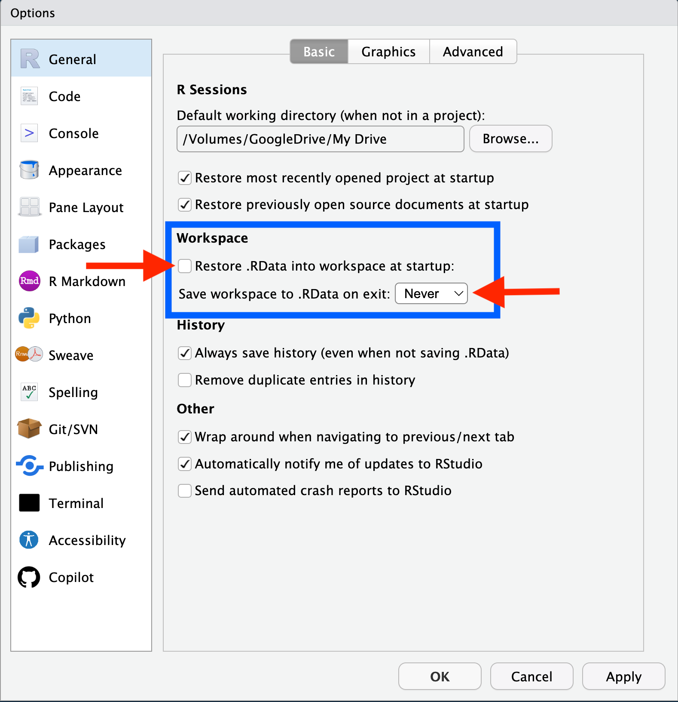

```{r setup,  echo = FALSE, message = FALSE, include = FALSE}
knitr::opts_chunk$set(
  collapse = TRUE,
  comment = "#>",
  warning = FALSE, 
  message = FALSE, 
  fig.width = 9,
  fig.height = 8,
  out.width = "100%"
)
options(scipen = 999, digits = 4, # Prevents sci notation and sets the output of decimals to 4 (0.0000)
        tibble.print_min = 5L, tibble.print_max = 5L) # tibble only print 5 rows 
# library(blackstone) # load Blackstone R package
set.seed(424629) # set reproducible seed
```

This vignette will go over best practices and standard workflows for using `R` and `RStudio` for Blackstone Research and Evaluation (`BRE`). 

This will include:

- Setting up basic global options in `RStudio`.

- Creating and using `R` Project files.

- Using the `here` package to build file paths inside Blackstone Google Drive project folders.

## Shared Workflow

[`RStudio`](https://posit.co/download/rstudio-desktop/) is an integrated development environment (IDE) that is designed to run [`R`](https://www.r-project.org/), a  programming language. At Blackstone Research and Evaluation, we will strive to utilize best practices with data science and that starts with implementing a shared workflow. This starts with making all of our work reproducible across all projects.

Any work product (Rmarkdown or `R` script) should be saved to the correct Blackstone Google Drive project folder. Anyone at `BRE` should be able to open the Rmarkdown (Rmd) or `R` script and run it on their own local machine to reproduce the results. In order to achieve this, we must use the same standard workflow and setup in `RStudio`.

## `RStudio` Setup

The first step is to make sure that each new `R` session is a blank slate and nothing that we have done previously carries over to our current work.
There are two ways to do this: either run `usethis::use_blank_slate()` or in `RStudio` go to the top menu bar and select '**Tools**', then '**Global Options**', '**General**' settings and make sure the '**Workspace**' section (in the blue box) matches the options in the figure below: 

```{r out.width = '70%', echo = FALSE}

```

This will ensure that each new `R` session is a blank slate. 

Also, it is important to routinely restart your `R` session and re-run your code to make sure that everything in code produces the expected results, figures, and outputs.
This can be done by in `RStudio` by selecting '**Session**' in to the top menu bar clicking on '**Restart R**' (Windows keyboard shortcut: Ctrl+Shift+F10, Mac: Shift+Command+0). This will clear your global environment and unload all R packages.

Re-run your code to ensure it includes everything necessary to complete the assigned data tasks.

## Creating and using `R` Project files.


